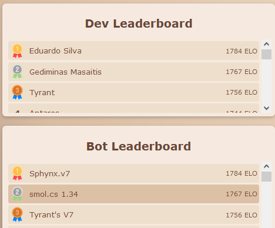
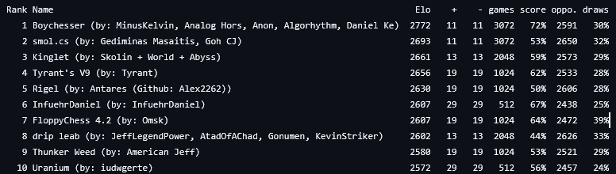

# Chess Engine


<div align="center">
  <h3>A compact chess engine built for Sebastian Lague's Chess Coding Challenge</h3>
  <p>Advanced search algorithms and evaluation packed into 1024 tokens</p>
</div>

---

**A miniaturized chess engine implementing negamax search with alpha-beta pruning, transposition tables, and PeSTO evaluation.**

Sphynx demonstrates efficient chess AI within extreme code size constraints. Built for the [Chess Coding Challenge](https://github.com/SebLague/Chess-Challenge), it achieves competitive play through carefully optimized algorithms and compressed evaluation tables.

## Quick Facts

- **Search Technique**: Negamax with aspiration windows
- **Evaluation**: PeSTO piece-square tables + material
- **Memory**: 4M entry transposition table
- **Optimization**: History heuristic, killer moves, late move reductions

## Why This Implementation

Chess engines typically span thousands of lines. This challenge demanded different thinking - every token counted against a strict budget where all variable names cost exactly one token regardless of length. Majin balances search depth, evaluation accuracy, and move ordering within these constraints, achieving strong tactical play despite the limitations.

## Features

**Search Algorithm**
- Negamax framework with alpha-beta pruning
- Iterative deepening with aspiration windows
- Quiescence search for tactical stability
- Null move pruning for forward pruning
- Late move reductions for search efficiency

**Move Ordering**
- Transposition table move prioritization
- MVV-LVA (Most Valuable Victim - Least Valuable Attacker) for captures
- Killer move heuristic (2 per ply)
- History heuristic for quiet moves

**Evaluation**
- PeSTO compressed piece-square tables
- Tapered evaluation (middlegame to endgame)
- Bishop pair bonus
- Material counting

**Memory Management**
- 4M entry transposition table (64MB)
- Exact, alpha, and beta bound storage
- Zobrist key collision handling

## Technical Implementation

**Negamax Search**  
The engine uses negamax, a simplified minimax variant exploiting chess's zero-sum property. Alpha-beta pruning eliminates branches that cannot influence the final decision, dramatically reducing nodes evaluated. Iterative deepening searches progressively deeper, using shallower results to improve move ordering.

**Aspiration Windows**  
Rather than searching with infinite bounds, aspiration windows narrow the alpha-beta range around the previous iteration's score. When the search falls outside this window, bounds expand dynamically. This technique reduces nodes searched when the position remains stable.

**Transposition Tables**  
Chess positions transpose through different move orders. The transposition table caches position evaluations using Zobrist hashing, preventing redundant searches. Each entry stores the best move, search depth, score, and bound type (exact/alpha/beta).

**Move Ordering Priority**
1. Hash move (from transposition table)
2. Winning captures (MVV-LVA)
3. Killer moves (refutation moves)
4. History heuristic (previously good quiet moves)
5. Remaining moves

**Quiescence Search**  
Stopping search at arbitrary depths creates the horizon effect - the engine misses tactics just beyond its view. Quiescence search extends tactical lines (checks, captures) until quiet positions emerge, preventing gross tactical oversights.

**PeSTO Evaluation**  
PeSTO (Piece-Square Tables Only) compresses grandmaster games into position-dependent piece values. The tables are packed into BigInteger literals and unpacked at initialization. The engine interpolates between middlegame and endgame tables based on remaining material.

**Pruning Techniques**  
Null move pruning assumes passing the turn (illegal in chess) would still produce a strong position. If giving the opponent a free move fails to raise beta, the position is strong enough to prune. Late move reductions search later moves (likely weaker) at reduced depth, only extending if they surprisingly raise alpha.

## Challenge Constraints

The Chess Coding Challenge imposed strict limitations:

- **Token Limit**: 1024 tokens maximum (variable names count as 1 token regardless of length)
- **Namespaces**: Only System, System.Linq, System.Numerics, System.Collections.Generic, ChessChallenge.API
- **Memory**: 256MB for lookup tables
- **Time**: 5 second initialization, variable per-move time
- **File**: All code in MyBot.cs

String literals count as many tokens as characters in the string. Whitespace, comments, semicolons, commas, and access modifiers don't count.

## Code Optimizations

**Token Reduction Techniques**
- Descriptive variable names since length doesn't matter (`movesTried` vs `m`)
- Inline calculations to reduce intermediate variables
- Packed data structures (BigInteger for PeSTO tables)
- Reusing variables across different scopes
- Ternary operators for conditional assignment
- Variable reuse (e.g., `timeLimit` during initialization, then for actual time limiting)

**Search Optimizations**
- Move ordering prevents searching inferior moves deeply
- Transposition table cutoffs skip entire subtrees
- Null move pruning eliminates hopeless positions early
- History heuristic learns from previous searches
- Killer moves remember recent refutations

## Algorithm Flow

```
Think()
├── Initialize time control (1/30 of remaining time)
├── Iterative deepening loop
│   ├── Negamax(depth, alpha, beta)
│   │   ├── Check transposition table
│   │   ├── Evaluate if quiescence depth
│   │   ├── Static pruning (null move, futility)
│   │   ├── Generate and order moves
│   │   ├── For each move:
│   │   │   ├── Principal variation search
│   │   │   ├── Late move reduction
│   │   │   └── Update best move/alpha
│   │   └── Store in transposition table
│   └── Adjust aspiration window
└── Return best move
```

## Performance Characteristics

**Depth Reached**: 8-12 ply typical, deeper in endgames  
**Nodes/Second**: ~50k-200k depending on position complexity  
**Transposition Hits**: 40-60% of lookups in tactical positions  
**Time Management**: Allocates 1/30 of remaining time per move

The engine plays at approximately 1800-2000 Elo strength (estimated) within the challenge framework, achieving solid tactical awareness and reasonable positional understanding given the constraints.

## Challenge Results

Unfortunately due to personal reasons I was not able to submit my version to the challenge but here is a comparison between how my bot was doing in the preparation tournaments held by the community vs how the opponents' bots performed in the actual tournament.
<p align="center">
    <a href="https://github.com/SebLague/Tiny-Chess-Bot-Challenge-Results/blob/main/RatingsList.txt">
      
    </a>
    <br />
    Preparation Tournament
    <br />
    <br />
    <a href="https://github.com/SebLague/Tiny-Chess-Bot-Challenge-Results/blob/main/RatingsList.txt">
      
    </a>
    <br />
    Tournament Results
  </p>

## Technical Insights

**What Worked**
- PeSTO evaluation provides strong positional sense with minimal tokens
- Aspiration windows significantly reduce search time
- History heuristic improves move ordering without table overhead
- Quiescence search prevents tactical blindness

**Token Budget Trade-offs**
- Detailed endgame knowledge traded for search depth
- Complex evaluation features (king safety, pawn structure) sacrificed for simplicity
- Move generation relies on framework rather than custom bitboard manipulation

**Future Improvements (If Constraints Lifted)**
- Opening book for theoretical lines
- Advanced king safety evaluation
- Passed pawn detection and evaluation
- Piece mobility metrics
- Endgame tablebases

## Development Context

This project demonstrates AI search algorithms, evaluation function design, and optimization under constraints. The 1024 token limit forced architectural decisions around feature prioritization - which improvements provide the most playing strength per token spent.

The codebase uses descriptive names where helpful since token counting treats all identifiers equally. The architecture separates concerns (search/evaluation) while sharing data structures to minimize overhead.

## License

This code was created for Sebastian Lague's Chess Coding Challenge. The Chess-Challenge framework is provided by Sebastian Lague.

---

<div align="center">
  <sub>Built with negamax, optimized for tokens</sub>
</div>
